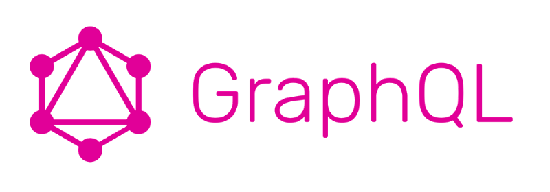
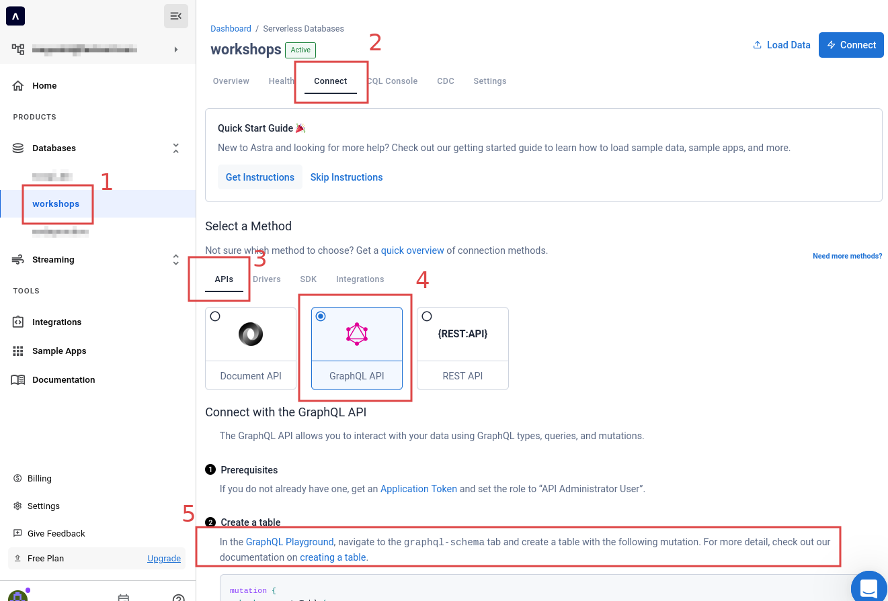
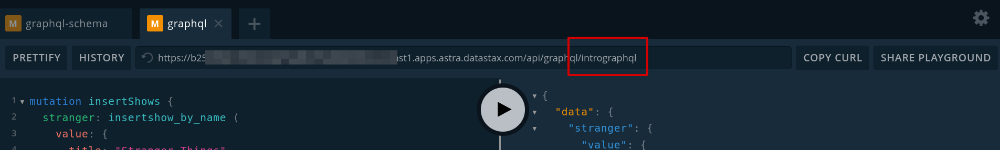
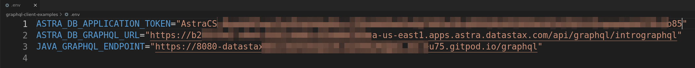
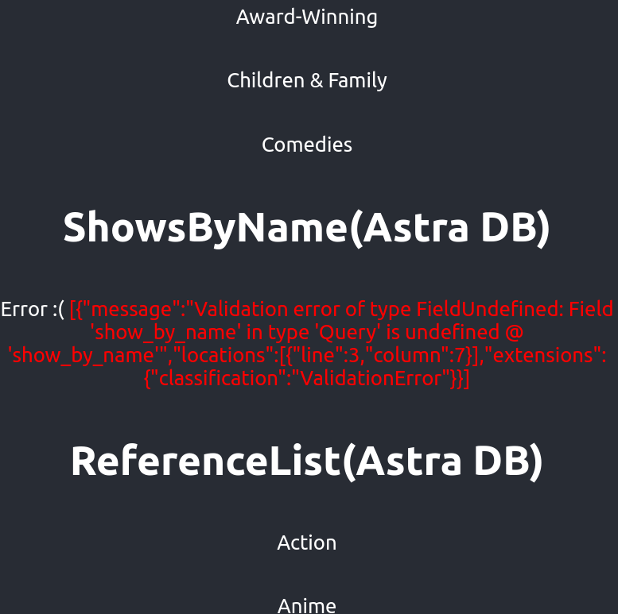

# 🎓 Introduction to GraphQL + React + Java + Astra DB

[](https://gitpod.io/from-referrer/)
[](http://www.apache.org/licenses/LICENSE-2.0)
[](https://discord.com/widget?id=685554030159593522&theme=dark)

*50 minutes, Beginner/Intermediate, [Start Building](#1-login-or-register-to-astradb-and-create-database)*

Both a simple **graphQL** enabled **ReactJS** app built using [**create-react-app**](https://create-react-app.dev/) AND a simple **Java** backend **graphQL** service built with [**Spring Initializr**](https://start.spring.io/) and using [**The Netflix DGS framework**](https://netflix.github.io/dgs/getting-started/) PLUS **Astra DB** hooked up and ready to rock! :heart_eyes_cat:

This is a companion to our [Netflix Clone using Astra DB and GraphQL](https://github.com/datastaxdevs/appdev-week3-graphql) workshop and is essentially a "prologue" to that content. Once complete, feel free to to go deploy a Netflix clone using what you learned here.

Finally, this content uses **React/JS** concepts. If you are not familiar with those or need a refresher, [take a look HERE](https://github.com/datastaxdevs/react-basics) to get up to date.

The materials have been built by the DataStax developer advocates team.



## 🎯 Objectives
* An overview of what GraphQL is and what makes it cool
* What differs between GraphQL, REST, other APIs, and their pros/cons
* Hands-on examples of GraphQL queries and mutations
* How to build GraphQL APIs for mobile and web applications
* Setting up your Astra DB to store application data via GraphQL

## ℹ️ Frequently asked questions ℹ️

<p/>
<details>
<summary><b> 1️⃣ Can I run this workshop on my computer?</b></summary>
<hr>
<p>There is nothing preventing you from running the workshop on your own machine. If you do so, you will need the following:
<ol>
  <li><a href="https://www.whitesourcesoftware.com/free-developer-tools/blog/update-node-js/">node 15 or 16 and npm 7 or later</a></li>
  <li>netlify-cli (use "npm install -g netlify-cli")</li>
</ol>
</p>
You will have to adapt commands and paths based on your environment (including digging into file ".gitpod.yml") and install the dependencies by yourself. <strong>We won't provide support</strong> to keep on track with schedule. However, we will do our best to give you the info you need to be successful. <strong>This is considered a more advanced path to take.</strong>
</details>
<p/>
<details>
<summary><b> 2️⃣ What other prerequisites are there?</b></summary>
<hr>
<ul>
<li>You will need a github account</li>
<li>You will need an Astra DB account, but we'll work through that in the exercises</li>
</ul>
</p>
</details>
<p/>
<details>
<summary><b> 3️⃣ Do I need to pay for anything for this workshop?</b></summary>
<hr>
<b>No.</b> All tools and services we provide here are FREE. FREE not only during the session but also afterwards.
</details>
<p/>
<details>
<summary><b> 4️⃣ Will I get a certificate if I attend this workshop?</b></summary>
<hr>
Attending the session is not enough. You need to complete the homework detailed below and you will get a nice badge that you can share on linkedin or anywhere else <strong>(open badge specification)</strong>.
</details>
<p/>


## Materials for the Session

It doesn't matter if you join our workshop live or you prefer to do at your own pace, we have you covered. In this repository, you'll find everything you need for this workshop:

- [Slide deck](./slides/slides.pdf)
- [Discord chat](https://bit.ly/cassandra-workshop)
- ["cassandra" on StackOverflow](https://stackoverflow.com/questions/tagged/cassandra)
- ["cassandra" on DBA StackExchange](https://dba.stackexchange.com/questions/tagged/cassandra)

## Homework


Don't forget to complete your upgrade and get your verified skill badge! Finish and submit your homework!

1. Complete the practice steps from this repository, as described below, to the end;
2. Insert (mutate) a **new show** or a **new genre** of your choice in the database;
3. Take a single **screenshot** of the React app with all of the working Astra DB sections and showing the entry you just added;
4. Submit your homework [here](https://dtsx.io/homework-intro-graphql).

That's it, done.
We will then grade the submissions: expect an email in a few days!

# Let's start


### Extra resources
[graphql.org](https://graphql.org/) - The first place to learn about GraphQL

[The Netflix DGS framework Tutorial](https://netflix.github.io/dgs/getting-started/) - Java/Spring GraphQL backend (used to generate this code)

[Spring Initializr](https://start.spring.io/) - Used in the ^above tutorial to generate the Java/Spring backend starter

[GraphiQL](https://www.gatsbyjs.com/docs/how-to/querying-data/running-queries-with-graphiql/) - GraphQL IDE included with The Netflix DGS Framework

[Apollo client](https://www.apollographql.com/docs/react/) - Awesome GraphQL client for React/JS (not used here, but really solid, Netflix uses this)

[Top 7 GraphQL IDEs](https://hasura.io/blog/top-7-graphql-ides-you-should-know-about-in-2021/) - A nice collection of cool GraphQL IDEs to use

[create-react-app tutorial](https://create-react-app.dev/) - Create a React app from scratch (used to generate this code)

[A Beginner's Guide to GraphQL](https://www.youtube.com/watch?v=c2fJ7T0N1Sk) - Ali Spittel's really awesome GraphQL starter video


## 1. Login or Register to AstraDB and create database

_**`ASTRA DB`** is the simplest way to run Cassandra with zero operations at all - just push the button and get your cluster. No credit card required, 40M read/write operations and about 80GB storage monthly for free - sufficient to run small production workloads. If you end your credits the databases will pause, no charge_

Leveraging [Database creation guide](https://awesome-astra.github.io/docs/pages/astra/create-instance/#c-procedure) create a database. *Right-Click the following button* with *Open in a new TAB.*

<a href="https://astra.dev/yt-11-23"></a>

|Field|Value|
|---|---|
|**Database Name**| `workshops`|
|**Keyspace Name**| `intrographql`|
|**Regions**| Select `GOOGLE CLOUD`, then an Area close to you, then a region with no LOCKER 🔒 icons: those are the region accessible to the Free Tier.

> **ℹ️ Note:** If you already have a database `workshops`, simply add a keyspace `intrographql` using the `Add Keyspace` button on the bottom right hand corner of the DB Dashboard page. You may have to "Resume" the database first in case it is in "hibernated" state.

While the database is being created, you will also get a **Security token**: 
save it somewhere safe, you will need it later to connect to the GraphQL endpoint for your DB
(in particular the string starting with `AstraCS:...`.)

> **⚠️ Important**
> ```
> The instructor will show the token creation on screen,
> but will then destroy it immediately for security reasons.
> ```

The status will change from `Pending` to `Active` when the database is ready, this will only take 2-3 minutes.


## 2. Create a security token

> Note: you should have a token already, in which case _skip to step 3_.
> In case you don't (e.g. you added a keyspace to a pre-existing database), read on.

[Create a token for your app](https://awesome-astra.github.io/docs/pages/astra/create-token/#c-procedure), _using the "Database Administrator" role_.
Keep it handy for later use (best to download the CSV token, as the values
will not be visible afterward). The token you'll need looks like `AstraCS:KDfdKeNREyWQvDpDrBqwBsUB:ec80667c....`

> **⚠️ Important**
> ```
> The instructor will show the token creation on screen,
> but will then destroy it immediately for security reasons.
> ```

## 3. Launch Gitpod

[Gitpod](https://www.gitpod.io/) is an 100% online IDE based on [VS Code](https://github.com/gitpod-io/vscode/blob/gp-code/LICENSE.txt?lang=en-US). To initialize your environment simply click on the button below _(CTRL + Click to open in new tab)_ You will be asked for you github account, as needed.

[](https://gitpod.io/#https://github.com/datastaxdevs/workshop-intro-to-graphql)


This will bootstrap your demo environment. Be patient, it will take a couple minutes as everything loads up.

> **Note**: during loading of the Gitpod environment, a new tab will be tentatively opened
> with an URL such as `https://8080-datastaxdev-[...].gitpod.io/graphiql`.
> Please **CHECK YOUR POPUP BLOCKER** and allow it before continuing!

## 4. Experiment with GraphiQL
It just so happens that [The Netflix DGS framework](https://netflix.github.io/dgs/getting-started/) comes with GraphiQL already integrated and ready for use. This is a wonderful tool you can use to explore graphQL queries and mutations. Let's experiment with this now!

#### Here's the schema defined in our java backend per `graphql-backend-examples/src/main/resources/schema/schema.graphqls`

```GraphQL
type Query {
    shows(titleFilter: String): [Show]
    genres(labelFilter: String): [Genre]
}

type Show {
    title: String
    releaseYear: Int
}

type Genre {
    value: String!
}
```

Something to point out here is there is no database just yet. We are powering the graphQL schema via the back-end Java application and the graphQL data is completely hardcoded. Take a look at both **`ShowsDatafetcher.java`** and **`GenresDatafetcher.java`** located in **`graphql-backend-examples/src/main/java/com/example/demo`** to find the simple implementations using DGS annotations `@DgsComponent` and `@DgsQuery`.

#### Now, let's try out some graphQL queries
Plug these into the GraphiQL IDE that launched into a new tab from GitPod.

```GraphQL
query justTitle {
  shows {
    title
  }
}
```

```GraphQL
query withReleaseYear {
  shows {
    title
    releaseYear
  }
}
```

```GraphQL
query getOneShow {
  shows (titleFilter: "Ozark") {
      title
      releaseYear
  }
}
```

```GraphQL
query ShowsAndGenres {
  shows {
    title
    releaseYear
  }
  genres {
    value
  }
}
```


## 5. Start up React
Ok, so we've played a bit with some graphQL queries on the backend and looked at how a basic schema works, but how do we hook this into our React JS app?

#### First, we need to run a couple commands to get things setup
In your **`GitPod`** IDE navigate to the "Client" terminal
*(it should already be open for you on the bottom left)*
and make sure you are in the **`workshop-intro-to-graphql/graphql-client-examples`** directory.
**This is where you'll be running the nodejs/React app.**

#### ✅  Execute the following command
```shell
npm install -g netlify-cli
```

This will install the **Netlify CLI** (command line interface) which our **React/JS** app uses in conjunction with the serverless functions we've setup to talk to our **graphQL** endpoints.

#### ✅  Then, execute
```shell
netlify dev
```

This will start the **React/JS** application and display results from both the **`Shows`** and **`Genres`** **graphQL** queries and endpoints we were just experimenting with.

#### Compare javascript code to our graphQL queries from above
If you take a look at both **`getShowsBackend.js`** and **`getGenresBackend.js`** located in **`graphql-client-examples/functions`** you should notice that both use the **same exact** **graphQL** queries that we used above.

```javascript
const query = `
    query getAllShows {
      shows {
        title
        releaseYear
      }
    }
  `
```

```javascript
  const query = `
    query getAllGenres {
      genres {
        value
      }
    }
  `
```

All of the javascript wrapped around these is simply there to call the **graphQL** endpoint with the given query and pass the responseBody back to the calling function.

#### Now for the cool part

Take a look at **`Shows.js`** and **`Genres.js`** located in **`graphql-client-examples/src/components/`**. In both cases they use **React** state, `gqlResult`

```javascript
  const [gqlResult, setGqlResult] = useState(null)
```

to receive the responseBody from from our **graphQL** queries, set the **React** state, and inject the values dyanmically into the DOM. Check out the following javascript snippet from **`Shows.js`**.

```javascript
// Asynchronously fetch any "shows" graphQL data from the Java backend
// using the getShowsBackend serverless function to call out to the
// Netflix DGS Java graphQL endpoint
const response = await fetch("/.netlify/functions/getShowsBackend", {
    method: "POST",
})
const responseBody = await response.json()
setGqlResult(responseBody) // on response set our graphQL result state
```

Notice how the fields (title, releaseYear) match our **graphQL** `Shows` schema exactly.

```javascript
// Finally, if all other checks pass get the data
// from the payload via gqlResult state and inject it into the DOM
// Notice how the payload example below and the fields "title" and "releaseYear" match exactly
// {"data":{"shows":[{"title":"Stranger Things","releaseYear":2016},{"title":"Ozark","releaseYear":2017}...
return gqlResult.data.shows.map(({ title, releaseYear }) => (
    <div key={title}>
        <p>
        {title}: {releaseYear}
        </p>
    </div>
  ));
```

Notice how the field (value) matches our **graphQL** `Genres` schema exactly.

```javascript
// Finally, if all other checks pass get the data
// from the payload via gqlResult state and inject it into the DOM
// Notice how the payload example below and the fields "title" and "releaseYear" match exactly
// {"data":{"genres":[{"value":"Action"},{"value":"Anime"}...
return gqlResult.data.genres.map(({ value }) => (
    <div key={value}>
        <p>
        {value}
        </p>
    </div>
  ));
```

## 6. Hook up the data layer with Astra DB
Ok, let's take this a step further and hook our app up to a data layer. As this point you should have already [created your Astra DB database](#1-login-or-register-to-astradb-and-create-database).
Follow the instructions below to launch the **GraphQL Playground** provided in **Astra**:

#### ✅  Step 6a: Open GraphQL Playground:

1. Click on the "workshops" database on the left (expanding the list if needed)
2. Click `Connect` TAB
3. Click the `APIs`  connection method
4. Make sure `GraphQL API` is selected
5. Locate the link to your GraphQL Playground in the text


<details>
<summary><strong>Click here if you are using the "New Astra Experience" UI</strong></summary>



</details>


#### ✅  Step 6b: In GraphQL Playground, **Populate HTTP HEADER** variable `x-cassandra-token` on the bottom of the page with your token as shown below (including the `AstraCS:` part)
✅ Ensure you have the **`graphql-schema`** tab selected for this step

> Note: the GraphQL Playground starts with a ready-to-use _temporary token_ as the `x-cassandra-token` header. But we want the queries run in the Playground
> to be identical to those that the Netlify functions will run from code, so **please replace the token with your DB token as instructed**.


#### ✅  Step 6c: In GraphQL Playground, create a table with the following mutation, making sure to replace `intrographql` if you used a different keyspace name:

- Copy the following mutation on the left panel

```GraphQL
mutation {
  reference_list: createTable(
    keyspaceName:"intrographql",
    tableName:"reference_list",
    ifNotExists:true
    partitionKeys: [ 
      { name: "label", type: {basic: TEXT} }
    ]
    clusteringKeys: [
      { name: "value", type: {basic: TEXT}, order: "ASC" }
    ]
  )
}
```
* Use the arrow in the middle of the screen to execute the query


## 7. Insert data in the Table with GraphQL

#### ✅  Step 7a: In graphQL playground, switch to the second Playground tab (`graphql`). Edit the ending of the URL _shown within the Playground page_ from `system` to the keyspace name `intrographql`:



#### ✅  Step 7b: Populate **HTTP HEADER** variable `x-cassandra-token` on the bottom of the page with your DB token as shown below _(Note: you did this for the `graphql-schema` tab, now repeat for the `graphql` tab!)_


#### ✅  Step 7c: In GraphQL Playground,populate the `reference_list` table with the following values

- Copy the following mutation on the left panel

```GraphQL
mutation insertGenres {
  action: insertreference_list(value: {label:"genre", value:"Action"}) {
    value{value}
  }
  anime: insertreference_list(value: {label:"genre", value:"Anime"}) {
     value{value}
  }
  award: insertreference_list(value: {label:"genre", value:"Award-Winning"}) {
     value{value}
  }
  children: insertreference_list(value: {label:"genre", value:"Children & Family"}) {
     value{value}
  }
  comedies: insertreference_list(value: {label:"genre", value:"Comedies"}) {
     value{value}
  }
  documentaries: insertreference_list(value: {label:"genre", value:"Documentaries"}) {
     value{value}
  }
  drama: insertreference_list(value: {label:"genre", value:"Dramas"}) {
     value{value}
  }
  fantasy: insertreference_list(value: {label:"genre", value:"Fantasy"}) {
     value{value}
  }
  french: insertreference_list(value: {label:"genre", value:"French"}) {
     value{value}
  }
  horror: insertreference_list(value: {label:"genre", value:"Horror"}) {
     value{value}
  }
  independent: insertreference_list(value: {label:"genre", value:"Independent"}) {
     value{value}
  }
  music: insertreference_list(value: {label:"genre", value:"Music & Musicals"}) {
     value{value}
  }
  romance: insertreference_list(value: {label:"genre", value:"Romance"}) {
     value{value}
  }
  scifi: insertreference_list(value: {label:"genre", value:"Sci-Fi"}) {
     value{value}
  }
  thriller: insertreference_list(value: {label:"genre", value:"Thriller"}) {
     value{value}
  }  
}
```

* Use the arrow in the middle of the screen to execute the query

## 8. Retrieving list of values

#### ✅  Step 8a: In GraphQL Playground, not changing tab (yeah) list values from the table with the following query.

```yaml
query getAllGenre {
    reference_list (value: {label:"genre"}) {
      values {
      	value
      }
    }
}
```

*👁️ Expected output*


## 9. Hook the database up to our React/JS app
So, you just created a table, inserted (mutated) some rows into the table, and then retrieved all of the genres with the "getAllGenre" query using the GraphQL Playground provided as part of Astra DB. Now, let's hook our client up to our Astra DB graphQL endpiont and render the results to our website with React.

#### ✅ Step 9a: Configure database credentials
In the **`GitPod`** IDE, click on the "Client" terminal to make it active, hit `Ctrl-C` to stop the running client, if any, and make sure you are in the **`workshop-intro-to-graphql/graphql-client-examples`** directory.

Now you will create a `.env` file with connection info (addresses and secrets) for the Netlify function to be able to reach both the local backend and your Astra DB's GraphQL endpoint.

<!--- TODO: replace with astra-cli usage --->

Paste this in the console (which will create and open a stub for the `.env`):
```shell
echo "ASTRA_DB_APPLICATION_TOKEN=\"AstraCS:...\"" > .env
echo "ASTRA_DB_GRAPHQL_URL=\"https://....apps.astra.datastax.com/api/graphql/intrographql\"" >> .env
cat .local-backend.env >> .env
gp open .env
```

In the editor, fill the definitions in the `.env` with:

- your `AstraCS:...` Astra DB token string as `ASTRA_DB_APPLICATION_TOKEN`;
- the URL to your GraphQL (as found on the second Playground tab, ending in `.../intrographql`) as `ASTRA_DB_GRAPHQL_URL`.
  
The credentials are now all set up. Here is how the `.env` might look like (as a reference, check out the provided `.env.sample`):



#### ✅ Start your React app back up with the following command
```shell
netlify dev
```

#### ✅ Step 9b: Verify data load
At this point your app should be running with a bunch of data displayed in the **`Shows`**, **`Genres,`** and **`ReferenceList`** sections, but notice the **`ShowsByName`** section displays **"Error :("**



#### Can you figure out what's going on here?
Let's break this down.

* We just added the database configuration and the **`ReferenceList`** section is populated which tells us our DB config and graphQL endpoints are configured properly

* In the GraphQL Playground we added a schema for the **`reference_list`** table and added some data to the table, but we never created a schema for the **`ShowsByName`** section

* If you take a look at the **`getShowsAstra.js`** script in **`graphql-client-examples/functions`** you can see the graphQL being used to query for data
```javascript
exports.handler = async function (event) {
  const query = `
    query getAllShows {
      show_by_name {
        values {
          title
          releaseYear
        }
      }
    }
  `
```

#### ✅  Test this query in the GraphQL Playground **`graphQL`** tab
Copy this into the playground and press the _"play"_ button to execute the query. **NOTE, you can simply append the query to the end of the list and then choose the query you wish to execute when you hit the "play" button.**

```GraphQL
query getAllShows {
      show_by_name {
        values {
          title
          releaseYear
        }
      }
    }
```


#### View Results
Notice what happened here. We have a validation error because there is no schema associated with the query we just executed. GraphQL uses a typed validation system so this is something to expect if a query is malformed, missing a schema, or something along those lines. You will want to control for this in your code.


#### ✅ Step 9c: Create the **`ShowsByName`** table with a graphQL mutation to fix the app
Ok, so let's fix up the schema issue to resolve the error.

#### ✅ Execute the following mutation in the **`graph-schema`** tab of the GraphQL Playground
```GraphQL
mutation CreateShowsTable {
  createTable(
    keyspaceName: "intrographql"
    tableName: "show_by_name"
    partitionKeys: [{
      name: "title", type: {basic:TEXT}
    }]
    values:[{
      name: "releaseYear", type: {basic:INT}
    }]
  )
}
```


#### ✅ Verify result
Once executed you should see a result like this


#### ✅ Add some data
Now, go back to the **`graphql`** tab of the GraphQL Playground and add the following mutation
```GraphQL
mutation insertShows {
  stranger: insertshow_by_name (
    value: {
      title: "Stranger Things",
      releaseYear: 2016}) {
  	value{title}
  }
  ozark: insertshow_by_name (
    value: {
      title: "Ozark",
      releaseYear: 2017}) {
  	value{title}
  }
}
```


#### ✅ Check the result


#### ✅ Finally, refresh your React app
Notice this no longer displays **"Error :("**, but now correctly displays the data you just inserted (mutated). It might be fun to add some of your own data to this schema and refresh your page.


#### Feel free to experiment with a couple more graphQL queries now that you have some data in the table

Queries usually offer some way to restrict the results returned,
in the form of parameters passed to queries. Recall the original `getAllShows`, repeated here for convenience:


```GraphQL
query getAllShows {
  show_by_name {
    values {
      title
      releaseYear
    }
  }
}
```

Now let's see a way to pass a `title` parameter to the query and just get
matching values (a single entry, in this case):

```GraphQL
query getOneShow {
  show_by_name (value: {title: "Ozark"}) {
    values {
      title
      releaseYear
    }
  }
}
```

The following query, which uses the [more general `filter` syntax](https://docs.datastax.com/en/astra/docs/develop/dev-with-graphql-cql-first.html#_retrieve_data),
is completely equivalent to the previous one:

```GraphQL
query getOneShowF {
  show_by_name(filter: {title: {eq: "Ozark"}}){
    values {
      title
      releaseYear
    }
  }
}
```


### That's it, you did it! Nice job!
We hope this workshop gave you enough information on GraphQL to be dangerous and start you on a journey to using GraphQL in your own apps. Also, don't forget to do the [HOMEWORK](#homework)
